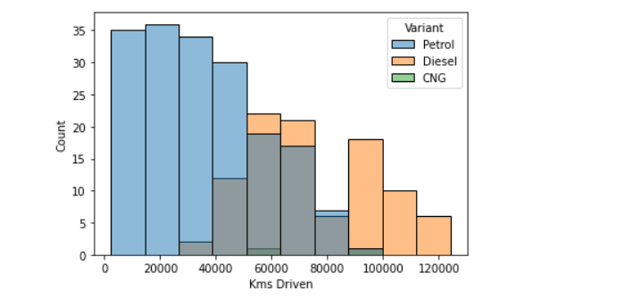

# Used Car 🚗 Price 💸 Prediction 

A ML project to predict price of second hand cars so that people can save time instead of searching on websites to find the desired price.


## Steps : 

1. Web Scrapping : Dataset was created using web scrapping techniques from a well renowed website <strong>cacardekho.com</strong>

2. EDA and Data Preprocessing : I tried to find out patterns in the dataset and preprocessed it accordingly.

3. Best ML Model : Best ML Model comes out to be Random Forest Regressor


## Web Application 

1. Web Applications runs on Flask Framework

2. Use Following Commands to run on your system (runs on localhost:5000)

```
pip install -r requirements.txt
python app.py
```


## EDA 📊

| Brands Distribution             |  Average Price of Each Brand |
:-------------------------:|:-------------------------:
  |  

<br>


| Pair Plot            |  Price of the Car wrt Variants |
:-------------------------:|:-------------------------:
  |  


<br>


| Kms Driven wrt Variant           |  Price of the Car wrt Transmission Type |
:-------------------------:|:-------------------------:
  |  


### Conclusions : 
1. People mostly sell Maruti Cars.
2. Prices of Luxurious car brands like Audi, BMW , Mercedez is higher
3. Some people are trying to manipulate prices on websites based on number of views and number of photos provided.
4. Petrol Variant is cheaper than Diesel
5. Automatic Transmission is Costlier than Mannual Transmission Variant

## Model Selection  


Best Model Comes out to be Random Forest Regressor in terms of R2 Score


### Note : Prices predicted by the Machine Learning Model may not be accurate.
